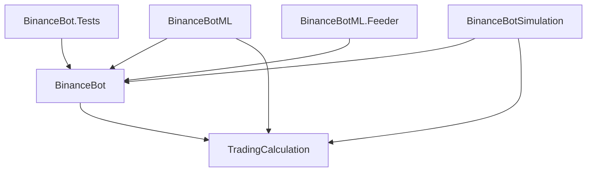

# BinanceBot - Automated Trading System

---

[](https://github.com/bogardt/BinanceBot/actions/workflows/dotnet.yml)
[](https://codecov.io/github/bogardt/BinanceBot)
[](https://dotnet.microsoft.com/)
[](https://dotnet.microsoft.com/apps/machinelearning-ai/ml-dotnet)
[](https://binance.com/)
[](LICENSE)

### Code Coverage Report

Check out our [code coverage report](https://codecov.io/github/bogardt/BinanceBot) for more details.


## 📋 Project Overview

BinanceBot is a multi-component automated trading system developed in .NET 8 to interact with the Binance API. The project is structured into several specialized modules enabling automated trading, machine learning analysis, simulation, and data feeding.

## 🏗️ Project Architecture

The project consists of 5 main modules:

### 1. **BinanceBot** (Main Module)

The core of the automated trading system that implements real-time trading logic.

**Features:**

- Automated trading with technical indicators (RSI, Moving Averages, Volatility)
- Buy and sell order management
- API data validation with FluentValidation
- Transaction logging and monitoring
- Dependency injection-based architecture

**Structure:**

- `Abstraction/` : Interfaces for service abstraction
- `BinanceApi/` : Binance API client and data models
- `Core/` : Main business logic (trading, pricing, actions)
- `Utils/` : Utilities (filesystem, HTTP, logging)

### 2. **BinanceBot.Tests** (Unit Tests)

Complete test suite to validate the main system behavior.

**Features:**

- Service integration tests
- Unit tests with mocking (Moq)
- Trading logic tests
- Service configuration validation

### 3. **BinanceBotML** (Machine Learning)

Experimental analysis and prediction module using machine learning.

**Features:**

- Predictive model training on historical data
- Market trend analysis
- Integration with Binance real-time data
- AI-based automated decision making

### 4. **BinanceBotSimulation** (Simulation)

Simulation and backtesting tool to test strategies without financial risk.

**Features:**

- Potential profit calculation
- Minimum margin simulation
- Strategy backtesting
- Performance analysis without using real funds

### 5. **BinanceBotML.Feeder** (Data Feeding)

Market data feeding and collection service for ML training.

**Features:**

- Binance historical data collection
- CSV export for analysis
- Continuous dataset feeding
- Data preparation for machine learning

## 🚀 Prerequisites

- **Visual Studio 2022** or higher
- **.NET 8 SDK**
- **Binance Account** with API Key and Secret
- **Git** for repository cloning

## ⚙️ Configuration

### 1. Clone the project

```bash
git clone https://github.com/bogardt/BinanceBot.git
cd BinanceBot
```

### 2. API Keys Configuration

Create an `appsettings.json` file in the root folder with your Binance keys:

```json
{
  "AppSettings": {
    "Binance": {
      "ApiKey": "your_binance_api_key",
      "ApiSecret": "your_binance_secret"
    }
  },
  "ConnectionStrings": {},
  "Logging": {
    "LogLevel": {
      "Default": "Information"
    }
  }
}
```

⚠️ **Important**: Never commit your real API keys to the repository!

## 🎯 How to Run the Projects

### BinanceBot (Main Trading)

```bash
# Via Visual Studio
1. Open BinanceBot.sln
2. Set BinanceBot as startup project
3. Press F5 or Ctrl+F5

# Via command line
cd BinanceBot
dotnet run
```

### BinanceBot.Tests (Unit Tests)

```bash
# Via Visual Studio
1. Open Test Explorer (Test > Test Explorer)
2. Click "Run All Tests"

# Via command line
cd BinanceBot.Tests
dotnet test

# With code coverage
dotnet test --collect:"XPlat Code Coverage"
```

### BinanceBotML (Machine Learning)

```bash
# Via Visual Studio
1. Set BinanceBotML as startup project
2. Run the project

# Via command line
cd BinanceBotML
dotnet run
```

### BinanceBotSimulation (Simulation)

```bash
# Via Visual Studio
1. Set BinanceBotSimulation as startup project
2. Run the project

# Via command line
cd BinanceBotSimulation
dotnet run
```

### BinanceBotML.Feeder (Data Collection)

```bash
# Via Visual Studio
1. Set BinanceBotML.Feeder as startup project
2. Run the project

# Via command line
cd BinanceBotML.Feeder
dotnet run
```

## 🧪 Running Tests

### Complete Unit Tests

```bash
# Run all tests
dotnet test

# Tests with verbose details
dotnet test --verbosity normal

# Tests with code coverage
dotnet test --collect:"XPlat Code Coverage" --results-directory TestResults

# Tests for a specific project
dotnet test BinanceBot.Tests/BinanceBot.Tests.csproj
```

### Coverage Analysis

```bash
# Generate a coverage report
dotnet test --collect:"XPlat Code Coverage" --results-directory TestResults
# The report will be generated in TestResults/
```

## 📦 Project Build

### Complete Solution Build

```bash
# Build all projects
dotnet build BinanceBot.sln

# Build in Release mode
dotnet build BinanceBot.sln --configuration Release

# Build a specific project
dotnet build BinanceBot/BinanceBot.csproj
```

## 🔍 Detailed Structure

### BinanceBot (Main Project)

```
BinanceBot/
├── Abstraction/                # Interfaces
│   ├── IApiValidatorService.cs
│   ├── IExchangeHttpClient.cs
│   ├── IMarketTradeHandler.cs
│   └── ...
├── BinanceApi/                 # Binance API Client
│   ├── BinanceClient.cs
│   ├── Model/                  # Data models
│   ├── Serializer/             # JSON serializers
│   └── Validation/             # FluentValidation validators
├── Core/                       # Business logic
│   ├── MarketTradeHandler.cs   # Trading handler
│   ├── PriceRetriever.cs       # Price retrieval
│   └── TradeAction.cs          # Trading actions
├── Utils/                      # Utilities
│   ├── FileSystem.cs
│   ├── Logger.cs
│   └── HttpClientWrapper.cs
└── Program.cs                  # Entry point
```

### Technologies Used

- **.NET 8** - Main framework
- **Microsoft.Extensions.Hosting** - Hosting and dependency injection
- **FluentValidation** - API data validation
- **Newtonsoft.Json** - JSON serialization
- **MSTest** - Unit testing framework
- **Moq** - Mocking framework for tests
- **TradingCalculation** - Technical indicators calculations

## 📊 Complete Solution Architecture

The BinanceBot solution consists of 6 interconnected projects, each serving a specific purpose in the automated trading ecosystem:

### 1. **TradingCalculation** (Core Library)

A foundational library that provides mathematical calculations and trading strategies.

**Key Components:**

- `ITechnicalIndicatorsCalculator` - Interface for technical analysis calculations
- `TechnicalIndicatorsCalculator` - Implementation of RSI, Moving Averages, Volatility calculations
- `TradingStrategy` - Configurable trading strategy parameters
- `StopLossStrategy` - Risk management strategy implementation

**Features:**

- RSI (Relative Strength Index) calculation
- Moving averages computation
- Volatility analysis
- Profit/loss calculations
- Minimum selling price determination
- Stop-loss strategy management

**Structure:**

```
TradingCalculation/
├── ITechnicalIndicatorsCalculator.cs    # Technical analysis interface
├── TechnicalIndicatorsCalculator.cs     # Core calculations implementation
└── Strategy/
    ├── TradingStrategy.cs               # Main trading parameters
    └── StopLossStrategy.cs              # Risk management settings
```

### 2. **BinanceBotML** (Machine Learning Module)

Advanced AI-powered trading analysis using Microsoft ML.NET framework.

**Dependencies:**

- Microsoft.ML (3.0.1)
- Microsoft.ML.FastTree (3.0.1)
- References BinanceBot project

**Key Components:**

- `AnalyzerML` - ML model training and prediction engine
- `TradingBot` - AI-driven trading decision maker
- `MarketData` - Data model for market information
- `MarketPrediction` - Prediction output model

**Features:**

- Historical data training with FastTree regression
- Real-time price prediction
- Automated buy/sell decision making
- Model performance evaluation (R², MAE, RMSE)
- Feature engineering with technical indicators

**ML Pipeline:**

1. Data loading from CSV files
2. Feature concatenation (Open, High, Low, Close, Volume, SMA)
3. Data normalization (MinMax scaling)
4. FastTree regression training
5. Model evaluation and prediction

**Structure:**

```
BinanceBotML/
├── AnalyzerML.cs              # ML training and prediction engine
├── TradingBot.cs              # AI decision-making system
├── MarketData.cs              # Input data model
├── MarketPrediction.cs        # Prediction output model
└── Program.cs                 # ML module entry point
```

### 3. **BinanceBotSimulation** (Backtesting & Analysis)

Risk-free trading simulation and performance analysis tool.

**Dependencies:**

- References BinanceBot project
- Uses TradingCalculation library

**Key Components:**

- `IMarketTradeHandlerSimulation` - Simulation interface
- `MarketTradeHandlerSimulation` - Profit calculation and analysis engine

**Features:**

- Profit/loss simulation without real trading
- Minimum margin calculation for profitability
- Fee and discount impact analysis
- Risk assessment and strategy validation
- Performance metrics computation

**Simulation Capabilities:**

- Calculate potential profits between price points
- Determine minimum selling prices for target profits
- Account for trading fees and discounts
- Test different quantity and price scenarios

**Structure:**

```
BinanceBotSimulation/
├── MarketTradeHandlerSimulation.cs     # Simulation engine
├── Program.cs                          # Simulation entry point
└── IMarketTradeHandlerSimulation       # Simulation interface
```

### 4. **BinanceBotML.Feeder** (Data Collection Service)

Automated market data collection and preprocessing for ML training.

**Dependencies:**

- References BinanceBot project
- Uses BinanceKlineConverter for data serialization

**Key Components:**

- `IFeeder` - Data feeding interface
- `FeedCsv` - CSV data collection and export service

**Features:**

- Historical market data retrieval from Binance API
- Configurable time intervals (1s, 1m, 1h, etc.)
- Batch data processing for large datasets
- CSV export for ML training
- Technical indicators calculation during data collection

**Data Collection Modes:**

- `Run()` - Multi-day historical data collection (1-minute intervals)
- `Run10Min()` - High-frequency data collection (1-second intervals)
- Batch processing to handle API rate limits
- Automatic CSV formatting for ML consumption

**Structure:**

```
BinanceBotML.Feeder/
├── FeedCsv.cs                 # Data collection and CSV export
├── IFeeder.cs                 # Feeding interface
└── Program.cs                 # Data feeder entry point
```

### 5. **BinanceBot.Tests** (Comprehensive Testing Suite)

Complete unit and integration testing framework.

**Dependencies:**

- MSTest.TestFramework (3.1.1)
- Moq (4.20.70) - Mocking framework
- coverlet.collector (6.0.0) - Code coverage
- References BinanceBot project

**Key Components:**

- `ProgramTests` - Main application flow testing
- Service configuration validation
- Integration testing with mocked dependencies

**Testing Coverage:**

- Dependency injection container validation
- Service lifecycle testing
- Trading logic validation with mock data
- API interaction testing
- Error handling and edge cases

**Structure:**

```
BinanceBot.Tests/
├── ProgramTests.cs            # Main test suite
├── Usings.cs                  # Global using directives
└── BinanceBot.Tests.csproj    # Test project configuration
```

### 6. **BinanceBot** (Main Trading Application)

The core application that orchestrates all components for live trading.

**Complete Architecture:**

```
BinanceBot/
├── Abstraction/                        # Service interfaces
│   ├── IApiValidatorService.cs
│   ├── IExchangeHttpClient.cs
│   ├── IFileSystem.cs
│   ├── IHttpClientWrapper.cs
│   ├── ILogger.cs
│   ├── IMarketTradeHandler.cs
│   ├── IPriceRetriever.cs
│   └── ITradeAction.cs
├── BinanceApi/                         # Binance integration
│   ├── BinanceClient.cs
│   ├── Model/                          # API data models
│   │   ├── Account.cs
│   │   ├── Balance.cs
│   │   ├── BinanceKline.cs
│   │   ├── Commission.cs
│   │   ├── Order.cs
│   │   └── TestOrder.cs
│   ├── Serializer/
│   │   └── BinanceKlineConverter.cs
│   └── Validation/                     # FluentValidation
│       ├── ApiValidatorService.cs
│       └── Validator/
├── Core/                               # Business logic
│   ├── MarketTradeHandler.cs
│   ├── PriceRetriever.cs
│   └── TradeAction.cs
├── Utils/                              # Utility services
│   ├── FileSystem.cs
│   ├── Helper.cs
│   ├── HttpClientWrapper.cs
│   └── Logger.cs
└── Program.cs                          # Application entry point
```

## 🔄 Project Interdependencies



## 💡 Usage Scenarios

### 1. **Live Trading** (BinanceBot)

```bash
cd BinanceBot
dotnet run
# Executes real-time trading with technical indicators
```

### 2. **ML-Powered Trading** (BinanceBotML)

```bash
cd BinanceBotML
dotnet run
# Uses AI predictions for trading decisions
```

### 3. **Strategy Testing** (BinanceBotSimulation)

```bash
cd BinanceBotSimulation
dotnet run
# Simulates trading strategies without real money
```

### 4. **Data Collection** (BinanceBotML.Feeder)

```bash
cd BinanceBotML.Feeder
dotnet run
# Collects historical data for ML training
```

### 5. **Quality Assurance** (BinanceBot.Tests)

```bash
dotnet test
# Validates all components functionality
```

## 🎛️ Configuration Management

All projects share the same `appsettings.json` configuration structure:

```json
{
  "AppSettings": {
    "Binance": {
      "ApiKey": "your_binance_api_key",
      "ApiSecret": "your_binance_secret"
    }
  },
  "ConnectionStrings": {},
  "Logging": {
    "LogLevel": {
      "Default": "Information"
    }
  }
}
```

### Trading Strategy Configuration

Customize trading parameters in `TradingStrategy.cs`:

- **TargetProfit**: Desired profit per trade (default: 10 USDT)
- **Quantity**: Trading volume (default: 200 SOL)
- **MaxRSI**: RSI threshold for sell signals (default: 70)
- **Symbol**: Trading pair (default: "SOLUSDT")
- **Period**: Analysis timeframe (default: 900 seconds)
- **Interval**: Data collection frequency (default: "1s")

## 🛡️ Risk Management

### Stop-Loss Configuration

- **StopLossPercentage**: Maximum acceptable loss (default: 5%)
- **VolatilityMultiplier**: Dynamic stop-loss adjustment (default: 2x)
- **FloorStopLossPercentage**: Minimum stop-loss (default: 1.2%)
- **CeilingStopLossPercentage**: Maximum stop-loss (default: 2%)

### Testing Modes

- **TestMode**: Enable paper trading (no real orders)
- **Simulation**: Use BinanceBotSimulation for risk-free testing
- **ML Validation**: Validate predictions before live trading

## 🤝 Contributing

1. Fork the project
2. Create a feature branch (`git checkout -b feature/AmazingFeature`)
3. Commit your changes (`git commit -m 'Add some AmazingFeature'`)
4. Push to the branch (`git push origin feature/AmazingFeature`)
5. Open a Pull Request

## 📄 License

This project is licensed. See the `LICENSE` file for more details.

## ⚠️ Warning

This bot is provided for educational and research purposes. Cryptocurrency trading involves significant financial risks. Use this software at your own risk and never trade with funds you cannot afford to lose.
